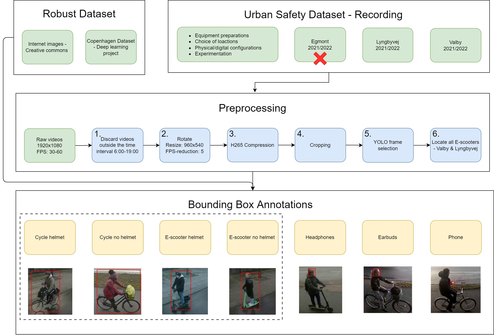
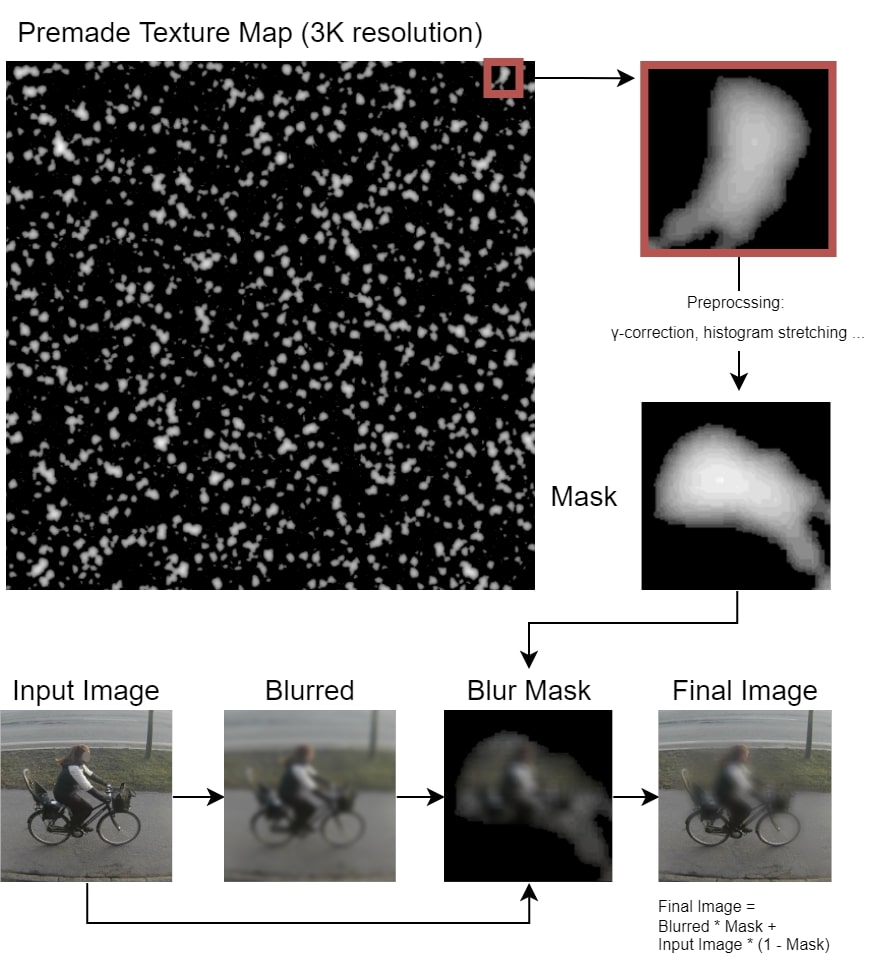
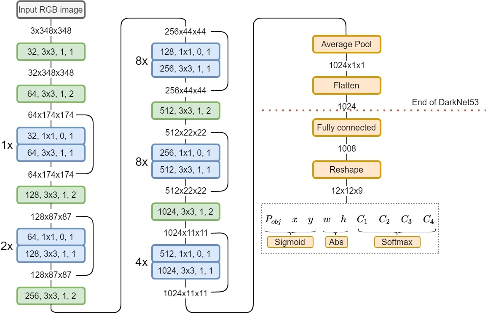
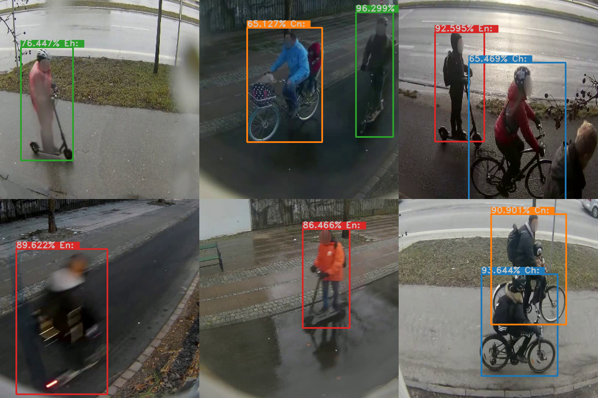
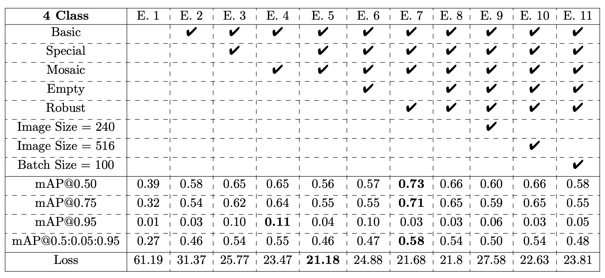

`Python`, `Deep Learning`,`Computer Vision`, `Data augmentation`, `Dataset creation`, `Pytorch`, `Object Detection`, `YOLO`, `Classification`, `Neural Network` 

# Bachelor Project - Detection of safety related objects on bicycles and e-scooters using YOLO

This project was made in collaboration with a fellow student. This project aimed to provide researchers with a tool that can automatically detect
safety-related features of bicyclists and users of e-scooters. We centered our research around implementing a deep learning model based on the 
”You Only Look Once” (YOLO) deep-learning object detection model. We implemented a custom-made model designed specifically to work on limited data
and be computationally efficient. Beside this two other contributions had been made. The novel Urban Safety Dataset, and a collection of diverse image 
augmentations designed for bike lane recordings. For ethical reasons we unfortunately cannot provide the dataset.

## The novel Urban Safety Dataset (USD)

The following illustration shows an overview on how the dataset was created:

 

  

 

## Data augmentation

Here we see an overview of how the hand-tailored data augmentation has be created:

 

  

 

## YOLO model

We have implemented a deep learning model based on the YOLO architecture. The model we have implemented use Darknet-53 as a backbone:

 

  

 

## Results

We have trained 11 models on a 4-class setup of USD in which the models were trained to detect helmet use for both bicyclists and users of e-scooters.
`Ch -> Cyclist with helmet`, `Cn -> Cyclist without helmet`, `Eh -> Escooter with helmet` and `En -> Escooter without helmet`. Below on the first image we see good examples from our best model's performance.

 

  

 

This illustration below is a table showing the mean average precision (mAP) score on the trained 11 models, which has been evaluated on the test-set.

 

  

 

